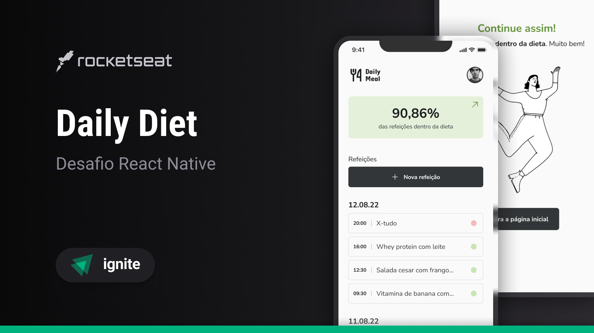

# Daily Diet API

<h1 align="center">
    
</h1>

<p align="center">
  <a href="#-technologies">Technologies</a>&nbsp;&nbsp;&nbsp;|&nbsp;&nbsp;&nbsp;
  <a href="#-getting-started">Getting started</a>&nbsp;&nbsp;&nbsp;|&nbsp;&nbsp;&nbsp;
  <a href="#-project">Project</a>&nbsp;&nbsp;&nbsp;|&nbsp;&nbsp;&nbsp;
  <a href="#-layout">Layout</a>&nbsp;&nbsp;&nbsp;|&nbsp;&nbsp;&nbsp;
  <a href="#-license">License</a>&nbsp;&nbsp;&nbsp;|&nbsp;&nbsp;&nbsp;
  <a href="#-requirements">Requirements</a>
</p>

<p align="center">
  
  
  

  
</p>

<p align="center">
  
</p>

## Aplicação de Registro de Refeições - Daily Diet API

### 🧪 Technologies

This project was developed using the following technologies:

- [Node.js](https://nodejs.org/en/)
- [Fastify](https://www.fastify.io/)
- [TypeScript](https://www.typescriptlang.org/)
- [Prisma](https://www.prisma.io/)
- [PostgreSQL](https://www.postgresql.org/)
- [JWT](https://jwt.io/)
- [Vitest](https://vitest.dev/)

## 🚀 Getting started

Clone the project and access the folder

```bash
$ git clone https://github.com/JeffyMesquita/daily-diet-api.git && cd daily-diet-api
```

Follow the steps below

```bash
# Install the dependencies
$ npm install

# Create a .env file and fill it with the environment variables from .env.example

# Start database in Docker
$ docker-compose up -d

# Create the database
$ npx prisma migrate dev

$ npx prisma generate


# Start the project
$ npm run start:dev

# The server will start at port 3333 - go to http://localhost:3333

# In Folder insomnia you can find the insomnia file to test the API

# Run tests
$ npm run test

or

$ npm run test:watch

and

$ npm run pretest:e2e && npm run test:e2e

or

$ npm run test:e2e:watch

```

## 💻 Project

App to register meals 🍲 and check if they are within the diet. The user can register, edit and delete meals, and also check metrics such as the total number of meals, the total number of meals within the diet, the total number of meals outside the diet and the best sequence of meals within the diet.

You can view the project layout through the links below:

## 🔖 Layout

You can view the project layout through the links below: [Layout](https://www.figma.com/community/file/1218573349379609244/Daily-Diet-•-Desafio-React-Native)

Remembering that you need to have a [Figma](http://figma.com/) account to access it.

## 📝 License

This project is licensed under the MIT License. See the [LICENSE](LICENSE.md) file for details.

---

## 📋 Requirements

### Requisitos Funcionais

- [x] Criação de usuário
- [x] Autenticação de usuário
- [x] Registro de refeições com nome, descrição, data e hora, e indicação se está dentro ou não da dieta
- [x] Edição de refeições
- [x] Exclusão de refeições
- [x] Listagem de todas as refeições de um usuário
- [x] Visualização de uma única refeição
- [x] Recuperação de métricas do usuário, incluindo quantidade total de refeições registradas, quantidade total de refeições dentro da dieta, quantidade total de refeições fora da dieta e melhor sequência de refeições dentro da dieta

### Regras de Negócio

- [x] As refeições devem ser relacionadas a um usuário
- [x] O usuário só pode visualizar, editar e apagar as refeições que ele criou

### Requisitos Não Funcionais

- [x] Utilização de banco de dados para armazenamento das informações do usuário e das refeições
- [x] Utilização de autenticação por token para identificar o usuário entre as requisições

Made with 💓 by [JeffyMesquita](https://www.linkedin.com/in/jeferson-mesquita-763bb6b8/) 👋
